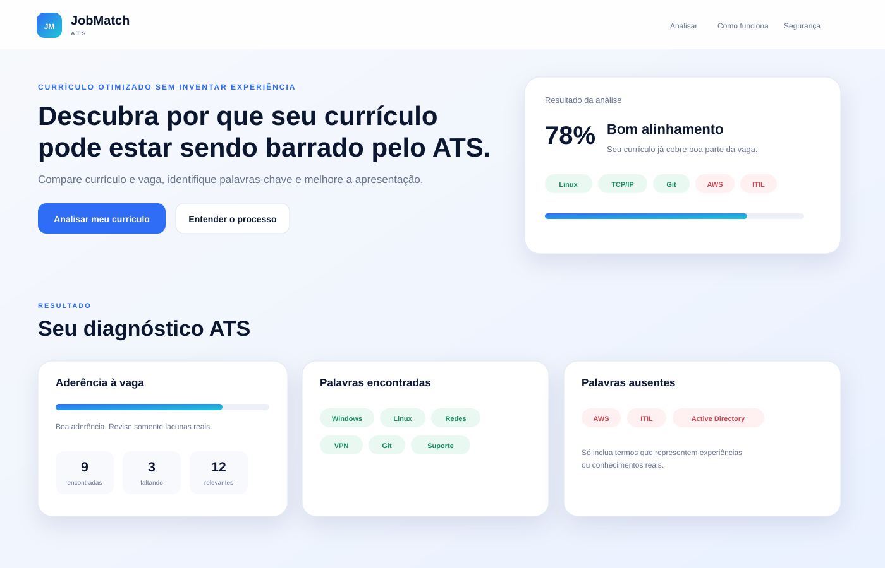

# JobMatch ATS

Aplicação web que compara um currículo com uma descrição de vaga, calcula aderência ATS, identifica palavras-chave encontradas e ausentes e gera uma versão mais limpa do currículo sem inventar experiências.

## Prévia



## Problema que resolve

Muitos currículos são descartados por sistemas ATS antes de uma pessoa do RH fazer a leitura. O problema nem sempre é falta de experiência: frequentemente o currículo não deixa explícitas competências que a vaga procura ou usa uma estrutura pouco amigável a sistemas de rastreamento.

O JobMatch ATS ajuda o candidato a entender essa diferença e reorganizar o texto sem fabricar informações.

## Regra central

> O sistema melhora como a pessoa se apresenta, mas nunca inventa experiência, formação ou competência que não esteja no currículo original.

Palavras ausentes são exibidas como lacunas e **não são adicionadas automaticamente** ao currículo ajustado.

## Funcionalidades

- campo para descrição da vaga;
- campo para currículo;
- score percentual de aderência;
- palavras-chave encontradas;
- palavras-chave ausentes;
- versão ATS-friendly reorganizada;
- copiar resultado;
- exportar como PDF usando a impressão do navegador;
- processamento 100% no navegador;
- layout responsivo.

## Como a análise funciona

1. A descrição da vaga é normalizada.
2. O sistema identifica termos técnicos conhecidos e palavras relevantes por frequência.
3. Esses termos são comparados com o currículo normalizado.
4. O score é calculado pela proporção de termos encontrados.
5. As palavras presentes e ausentes são exibidas separadamente.
6. A versão ajustada reorganiza o currículo e destaca somente competências que já aparecem no texto original.

## Mega prompt para Lovable

O mega prompt completo está em [`docs/mega-prompt.md`](docs/mega-prompt.md).

## Refinamentos

Os ajustes após a primeira versão estão documentados em [`docs/refinamentos.md`](docs/refinamentos.md).

## Tecnologias

- HTML5
- CSS3
- JavaScript
- design inspirado em **shadcn/ui**: cards, chips, botões, tipografia e espaçamento consistentes

## Executar localmente

Basta abrir `index.html` no navegador. Para evitar restrições locais, também pode usar:

```bash
python3 -m http.server 8080
```

Depois acesse `http://localhost:8080`.

## Evidências

A pasta `assets/` contém uma prévia visual da interface.

## Observação sobre a implementação

Este repositório implementa diretamente em código a especificação do desafio e documenta o mega prompt preparado para o Lovable. A implementação não depende de banco, login ou chaves externas e processa os dados localmente no navegador.
